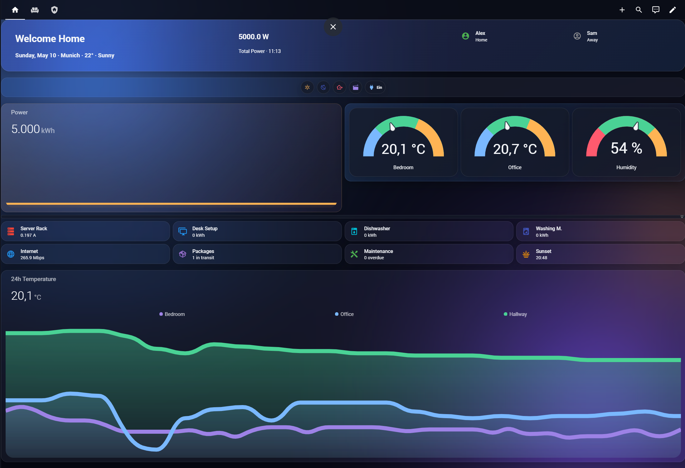
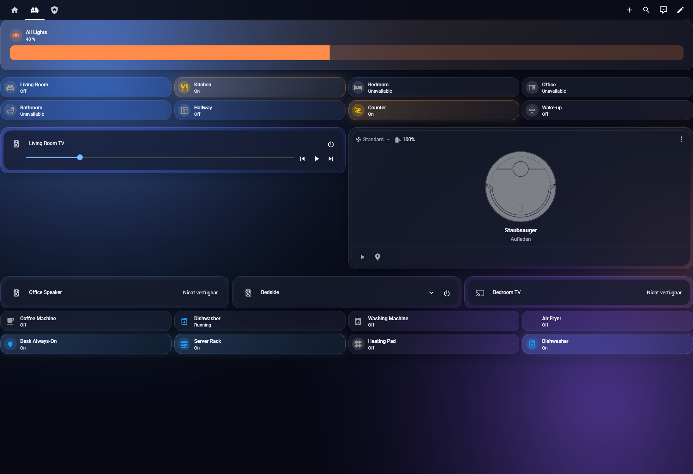
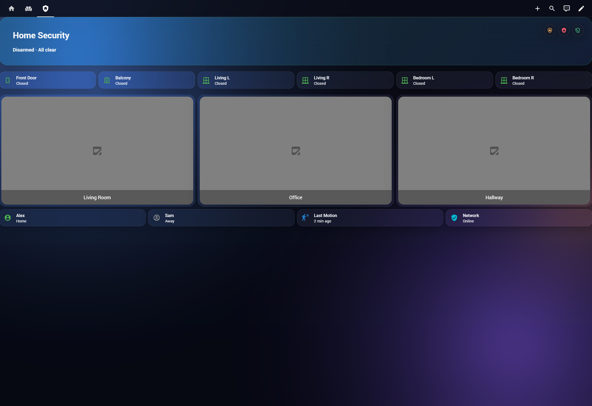

# Liquid Glass — Home Assistant Theme

[](https://hacs.xyz/)
[](https://www.home-assistant.io/)
[](LICENSE)
[](README.de.md)

A premium glass-morphism theme for Home Assistant — translucent surfaces, layered blur, soft accents, refined dark UI. Six variants in one file.

> Maintained by **studio-prisma**.



> 🎯 **Plug-and-play, with two effect tiers.** Install via HACS → activate the theme → done. **Tier 1** (automatic, no card-mod): every card inherits the Liquid Glass color tokens — translucent dark surface, rounded corners, refined borders, harmonized per-domain state colors, full WCAG-AA-compliant text. **Tier 2** (opt-in, card-mod required): the full glass-morphism backdrop blur seen in the screenshots — added per card via a single drop-in snippet. The Tier-2 split is deliberate: a global blur on `ha-card` is known to break Bubble Card v3 pop-ups, so we ship it as an explicit opt-in. See [Effect Tiers](#effect-tiers--what-the-theme-gives-you-automatically-vs-opt-in) below for the table and the copy-paste snippet, or jump to the [FAQ](#faq).

## Variants

| Theme name (HA dropdown) | Behavior |
|---|---|
| **Liquid Glass** ⭐ | **Default — always dark** with `aurora.png` background. Recommended. |
| **Liquid Glass Auto (experimental)** | OS-driven light/dark — known HA limitations (see note) |
| **Liquid Glass Light only** | Always light, ignores OS — `dawn.png` background |
| **Liquid Glass Compact** | Always dark + tighter spacing for wall-tablets |
| **Liquid Glass Sunset** | Always dark + warm rose/amber palette |
| **Liquid Glass Floorplan** | Always dark + heatmap glow for picture-element cards |

> ⚠️ **Why "Auto" is experimental:** HA's `modes:` block does not reliably override the `lovelace-background` CSS variable, and certain form/dropdown components (search fields, language picker) may render with mismatched colors. The auto variant is best-effort. For consistent results, pick a fixed variant. To switch automatically by sun position, use a `frontend.set_theme` automation between **Liquid Glass** and **Liquid Glass Light only** — see Auto-Switch Strategy below.

Pick in **Profile → Theme** or per dashboard via `theme: Liquid Glass Compact`.

## Overview — Lights, Media, Switches



> *Screenshot composition: Mushroom cards bring their own blur via `--mush-control-*` tokens (no card-mod needed); standard Tile/Thermostat cards in the lower half use the [Tier-2 snippet](#effect-tiers--what-the-theme-gives-you-automatically-vs-opt-in) to match the surrounding aesthetic. Without the Tier-2 snippet they render with Tier-1 token-only translucency.*

## Home Security View



> *Tile cards in this view use the Tier-2 `glass_card_base` snippet; the picture-element camera grid uses the Floorplan-variant tokens directly.*

## Features

- Glass-morphism with layered translucent surfaces and blur
- Per-domain status colors: light, switch, climate, cover, fan, media_player, person, lock, vacuum
- **Per-room accent tokens** (`room-living-rgb`, ...) — color cards differently per area
- **Energy Dashboard integration** — grid, solar, battery, gas, water harmonized
- **Notification toast styling** — system pop-ups match the theme
- **Form field & dropdown styling** — language picker, search fields, selects, alarm-code input, time pickers, tooltips, dialog popovers all render correctly in dark mode via HA's dark token system (`modes:` block triggers `darkSemanticColorStyles` + `<meta color-scheme=dark>` injection — see [Architecture](#architecture--token-layers))
- Sidebar refinement, Mushroom & Bubble card tokens
- Card-mod global variables
- **Background Pack** — four PNGs (Aurora, Dawn, Night, Calm)

## Effect Tiers — what the theme gives you automatically vs. opt-in

The theme delivers two layers of visual effect. Tier 1 is automatic; Tier 2 is a one-line card-mod opt-in.

| Card family | Tier 1 — automatic (no plugin) | Tier 2 — `glass_card_base` snippet (card-mod) |
|---|---|---|
| **Tile** | dark translucent BG, rounded, soft border, theme text | + full `backdrop-filter` blur, hover glow, glass-grade shadow |
| **Thermostat** | dark translucent BG, rounded, theme accent | + full blur, hover glow |
| **Area** | dark translucent BG, theme tokens | + full blur, soft border, hover glow |
| **Entities / Glance / Button** | dark translucent BG, theme tokens | + full blur, hover glow |
| **Mushroom** | dark translucent BG + Mushroom's own blur via `--mush-*` tokens (looks "full glass" already) | further refinements via `mushroom_glass` snippet |
| **Bubble Card** | dark translucent BG via theme tokens, pop-ups intact | per-card snippet only — do NOT apply a global `ha-card` blur |
| **picture-elements (Floorplan variant)** | heatmap-glow tokens via `--floorplan-*` | room-marker / heatmap snippets in `docs/floorplan-snippets.yaml` |

### Why Tier 2 is opt-in (not a default)

HA theme YAML can only define CSS *variables* — it cannot inject CSS *rules*. The `backdrop-filter: blur(...)` declaration is a rule, not a variable, so a theme cannot apply it globally to `ha-card` without going through a `card-mod-theme` override. We deliberately do **not** ship that override, because in earlier development we observed it breaking Bubble Card v3 pop-up rendering (Bubble Card issue #2347 — globally styled `ha-card-*` properties leak into the pop-up internals and the pop-up body renders empty). Tier 2 as a per-card opt-in is the safest path that preserves plugin compatibility.

### Copy-paste — the Tier-2 snippet

Drop this under any Tile, Thermostat, Area, Entities or Glance card to match the screenshots:

```yaml
type: tile
entity: light.living_room
card_mod:
  style: |
    ha-card {
      background: var(--glass-bg);
      backdrop-filter: var(--glass-blur);
      -webkit-backdrop-filter: var(--glass-blur);
      border: var(--glass-border);
      border-radius: var(--glass-radius);
      box-shadow: var(--glass-shadow);
    }
```

The snippet uses theme variables, so it adapts automatically when you switch between Liquid Glass / Light only / Compact / Sunset. Full snippet library: [`docs/card-mod-snippets.yaml`](docs/card-mod-snippets.yaml).

Prerequisite: [card-mod](https://github.com/thomasloven/lovelace-card-mod) installed via HACS.

## Tested With

- Home Assistant Core 2026.5.0
- Frontend 20260509.x (WebAwesome + Material Web 3 components)
- Supervisor 2026.05.0 / OS 17.3
- Browser: Chrome/Firefox/Safari/Edge desktop, iOS Companion App

Minimum supported: **Core 2024.1.0**. WCAG AA contrast verified for all dark variants (audit in v1.2.8).

## Installation

### Step 1 — Theme via HACS

1. **HACS** → **Frontend** → top-right menu → **Custom repositories**
2. URL: `https://github.com/studio-prisma/homeassistant-theme-liquid-glass`
3. Category: **Theme** → **Add** → install
4. Restart HA

`configuration.yaml`:

```yaml
frontend:
  themes: !include_dir_merge_named themes/
```

### Step 2 — Background images (one-time setup)

1. Create folder: `/config/www/liquid_glass/`
2. Download all four PNGs from [`docs/assets/backgrounds/`](docs/assets/backgrounds/) into the new folder:
   - `aurora.png` (default for Liquid Glass, Compact, Floorplan, Auto)
   - `dawn.png` (Light only, Sunset)
   - `night.png` (alternative)
   - `calm.png` (alternative)
3. Reload themes: Developer Tools → YAML → **Reload Themes**

Missing files → fallback to solid background color.

### Step 3 — Activate

**Profile → Theme** → **Liquid Glass** (recommended default).

## Background Pack

| File | Style | Default for |
|---|---|---|
| `aurora.png` | Deep blue ambient | Liquid Glass, Compact, Floorplan, Auto |
| `dawn.png` | Pastel sunrise | Light only, Sunset |
| `night.png` | Indigo + moon + stars | alternative |
| `calm.png` | Minimal teal waves | alternative |

### Switch backgrounds per dashboard

```yaml
title: Home
theme: Liquid Glass
background: 'center / cover no-repeat url("/local/liquid_glass/night.png") fixed'
views:
  - title: Overview
```

### Bring your own image

Any 1920×1200+ PNG/JPG. Drop into `/config/www/liquid_glass/` and reference via dashboard background.

**Free sources:**
- [Unsplash](https://unsplash.com/), [Pexels](https://pexels.com/), [Pixabay](https://pixabay.com/)
- AI generators: Midjourney / DALL-E / Stable Diffusion. Prompt: *"premium dashboard background, deep blue ambient, soft gradient, minimal, 16:10"*

Aim dark, low-contrast, ≤ 500 KB.

## Auto-Switch Strategy (recommended)

Skip the experimental built-in auto and use a HA automation — fully reliable:

```yaml
alias: Theme — Sunset to Dark
trigger:
  - platform: sun
    event: sunset
    offset: "-00:30:00"
action:
  - service: frontend.set_theme
    data:
      name: Liquid Glass

alias: Theme — Sunrise to Light
trigger:
  - platform: sun
    event: sunrise
action:
  - service: frontend.set_theme
    data:
      name: Liquid Glass Light only
```

Full light/dark transitions including backgrounds, no surprises.

## Demo Dashboard

[`docs/demo-dashboard.yaml`](docs/demo-dashboard.yaml) — generic showcase. Adjust entity IDs.

## Optional: Card-mod Snippets

> ℹ️ **Skip this section unless you want extra polish.** The theme works fully at Tier 1 without card-mod. The files below are **opt-in extras** — install card-mod only if you want Tier-2 effects (full blur on stock cards) or the extras listed here.

For users who already have or want to install [card-mod](https://github.com/thomasloven/lovelace-card-mod):

- [`docs/card-mod-snippets.yaml`](docs/card-mod-snippets.yaml) — twelve drop-in mods, starting with the Tier-2 `glass_card_base` recipe
- [`docs/floorplan-snippets.yaml`](docs/floorplan-snippets.yaml) — picture-element snippets

## Customization

### Override base colors

```yaml
Liquid Glass:
  primary-color: "#ff7a8a"
  accent-color: "#7af5b8"
```

### Per-room accent tokens

Each variant ships eight room tokens as RGB triplets, ready to use with `rgb()` / `rgba()` for area-specific tinting. Defaults live inside `themes/liquid_glass.yaml`; override per dashboard via card-mod or globally via theme-mixin.

| Token | Default (Liquid Glass) | Suggested area |
|---|---|---|
| `--room-living-rgb` | `255, 180, 84` (amber) | Living room |
| `--room-bedroom-rgb` | `157, 130, 230` (lavender) | Bedroom |
| `--room-office-rgb` | `122, 184, 255` (sky blue) | Office / Workspace |
| `--room-kitchen-rgb` | `255, 139, 74` (coral) | Kitchen |
| `--room-bathroom-rgb` | `100, 220, 220` (teal) | Bathroom |
| `--room-garden-rgb` | `74, 210, 149` (mint) | Garden / Outdoor |
| `--room-garage-rgb` | `120, 120, 130` (graphite) | Garage / Utility |
| `--room-workshop-rgb` | `255, 200, 100` (warm gold) | Workshop / Hobby |

**Theme-only usage (no plugin required):** the tokens are already wired into the theme's per-domain colors. You see them automatically.

**Optional — per-card override via card-mod** (requires the [card-mod](https://github.com/thomasloven/lovelace-card-mod) plugin):

```yaml
type: tile
entity: light.living_room_main
card_mod:
  style: |
    ha-card {
      background: rgba(var(--room-living-rgb), 0.18);
      border-left: 3px solid rgb(var(--room-living-rgb));
    }
```

**Override globally (per theme, no plugin):**

```yaml
Liquid Glass:
  room-living-rgb: "210, 90, 130"   # custom rose for living
  room-office-rgb: "90, 200, 170"   # custom teal for office
```

> Tokens are RGB triplets (no `rgb(...)` wrapper) so you can use them with both `rgb()` for solid colors and `rgba()` for transparency.

## Architecture — Token Layers

HA's frontend has accumulated several CSS-token generations as the codebase evolved. A theme that wants to render correctly on a modern HA install needs to cover all of them — that's why this file is large.

| Layer | Used by | Generation |
|---|---|---|
| `--mdc-*` | Legacy Material Design Components | HA ≤ 2023 |
| `--paper-*` | Polymer-era inputs | HA ≤ 2022 |
| `--input-*`, `--mwc-*` | HA aliases for the above | bridge layer |
| `--wa-color-*`, `--wa-form-control-*` | WebAwesome (Shoelace fork) — modern form controls | HA 2025+ |
| `--ha-color-*`, `--ha-color-fill-*-*-*`, `--ha-color-surface-*` | HA's own semantic token system | HA 2025+ |
| `--md-sys-color-*`, `--md-list-item-*` | Material Web 3 — combo-boxes, dialogs, list items | HA 2025+ |

### How `modes:` unlocks dark mode

HA's resolver (`src/state/themes-mixin.ts`) requires a theme to declare a `modes:` block before it loads `darkSemanticColorStyles` + `darkColorStyles`. Every dark variant in this theme declares an empty `modes: dark: {}` to trigger the load — that's what gives tooltips, dropdown popovers, dialog backgrounds, and active-filter pills their dark backgrounds without us having to enumerate every single token by hand.

Side effect: HA also injects `<meta name="color-scheme" content="dark">`, which gives browsers the actual CSS `color-scheme` property they need for the `light-dark()` function. Native `<input type="time">` and `<input type="number">` (alarm code, time pickers) inherit this and render correctly.

### Known limitations

- **Auto (experimental)** — its `modes.light` block is fully populated for OS-driven switching, but `modes.dark` is intentionally not declared (legacy decision from v1.1.2 to disable HA's auto-switch). Use the [Auto-Switch Strategy](#auto-switch-strategy-recommended) automation pattern for reliable light/dark transitions.
- **WCAG AA audit — Auto `modes.light` block** — token-by-token audit completed (13 critical pairs, same methodology as v1.2.8). **All 13 pairs pass** (3.78:1 to 17.18:1). The three previously-deferred marginal cases (filled-brand 3.63, tinted-brand 4.10, error-color 3.03) were resolved in this release — see CHANGELOG.

### Diagnosing issues

Open the offending element in DevTools → Elements → expand `#shadow-root` chains → Computed tab → look for the CSS variable that resolves the wrong color. Issue templates in [`CONTRIBUTING.md`](CONTRIBUTING.md) walk through the format.

## Versioning

[Semantic Versioning](https://semver.org/). See [`CHANGELOG.md`](CHANGELOG.md).

## Contributing

See [`CONTRIBUTING.md`](CONTRIBUTING.md).

## Credits

- Designed & maintained by **studio-prisma**
- Mushroom & Bubble card token compatibility ensured

## FAQ

### Do I need card-mod for every card?

No. The theme is plug-and-play at **Tier 1** — every Lovelace card you already have automatically picks up the Liquid Glass color tokens (translucent dark background, rounded corners, refined borders, WCAG-AA text). card-mod only comes into play for **Tier 2** — adding the full backdrop blur effect to stock cards, or applying the optional polish snippets in [`docs/`](docs/). See [Effect Tiers](#effect-tiers--what-the-theme-gives-you-automatically-vs-opt-in) for the exact split.

### Why don't my Tile / Thermostat / Area cards have the same blur as the screenshots?

That's the deliberate Tier-1 vs. Tier-2 split. Tier 1 is what every card inherits automatically: translucent dark surface, rounded corners, theme borders, harmonized state colors. Tier 2 — the full `backdrop-filter: blur(...)` glass effect — is opt-in per card via the `glass_card_base` snippet in [`docs/card-mod-snippets.yaml`](docs/card-mod-snippets.yaml). The reason it's not a default: applying `backdrop-filter` globally on `ha-card` via `card-mod-theme` has been observed to break Bubble Card v3 pop-up rendering, so we ship it as an explicit opt-in instead. Copy-paste the eight-line snippet under any card and you get the screenshot look. [Snippet](#effect-tiers--what-the-theme-gives-you-automatically-vs-opt-in) | [Full snippet library](docs/card-mod-snippets.yaml).

### Do I need to edit any YAML to use the theme?

No. The only manual step is copying the four background PNGs into `/config/www/liquid_glass/` (a one-time setup — see [Installation](#installation)). Everything else (theme variants, per-domain status colors, dark token coverage, energy dashboard styling) works automatically once you select the theme.

### What dashboard cards are shown in the screenshots?

Stock + popular community cards: standard Lovelace tile cards, [Mushroom](https://github.com/piitaya/lovelace-mushroom), [mini-graph-card](https://github.com/kalkih/mini-graph-card), [mini-media-player](https://github.com/kalkih/mini-media-player), [vacuum-card](https://github.com/denysdovhan/vacuum-card). The Mushroom and mini-graph cards bring their own blur and look "full glass" at Tier 1. The standard Tile cards visible in the screenshots use the Tier-2 `glass_card_base` snippet to match. A reference dashboard YAML (with placeholder entity IDs) is in [`docs/demo-dashboard.yaml`](docs/demo-dashboard.yaml).

### What's inside `themes/liquid_glass.yaml`?

A ~1250-line YAML file with six theme variants. You don't need to open or edit it — HACS installs it, HA loads it automatically. If you want to tweak colors, see [Customization](#customization) above.

### Why aren't the backgrounds installed automatically?

HACS can deliver theme YAML, but it cannot write into `/config/www/`. Lovelace references background images by URL path (e.g. `/local/liquid_glass/aurora.png`), so the four PNGs need to live in your config's `www/` folder. The one-time copy step is unavoidable — but it's literally drag-and-drop.

### Something looks wrong / contrast is off / a popup is white-on-white

That's a token-coverage gap on a specific HA frontend component. Open an issue with: HA Core version, browser, the affected element (DevTools → Elements → screenshot of the computed CSS variable). The [Diagnosing issues](#diagnosing-issues) section walks through it.

## License

MIT — see [LICENSE](LICENSE).
