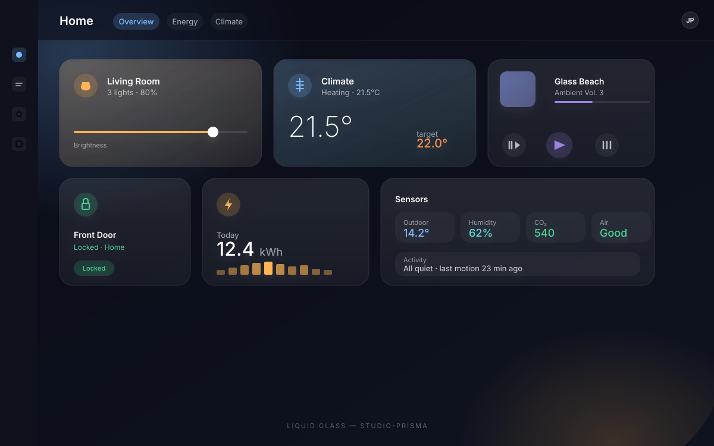
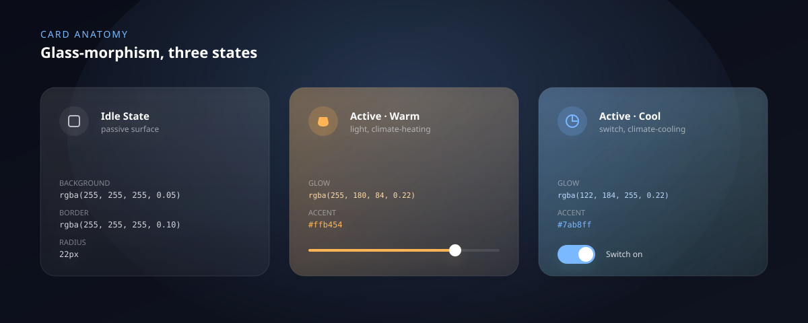
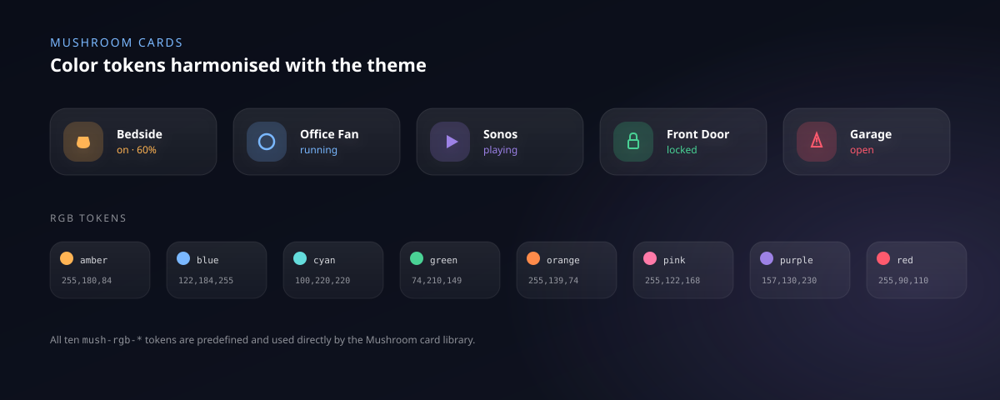

# Liquid Glass — Home Assistant Theme

[](https://hacs.xyz/)
[](LICENSE)
[]()
[](README.de.md)

A premium glass-morphism theme for Home Assistant — translucent surfaces, layered blur, soft accents, refined dark UI. Six variants in one file.

> Maintained by **studio-prisma**.



## Variants

| Theme name (HA dropdown) | Behavior |
|---|---|
| **Liquid Glass** | Auto-switch via OS prefers-color-scheme — colors only (no background image) |
| **Liquid Glass Light only** | Always light, ignores OS — uses `dawn.png` background |
| **Liquid Glass Dark only** | Always dark, ignores OS — uses `aurora.png` background |
| **Liquid Glass Compact** | Always dark + tighter spacing for wall-tablets |
| **Liquid Glass Sunset** | Always dark + warm rose/amber palette — uses `dawn.png` |
| **Liquid Glass Floorplan** | Always dark + heatmap glow for picture-element cards |

> **Why Auto-Switch has no background:** HA's `modes:` block does not reliably override the `lovelace-background` CSS variable across light/dark switches. To get a background image with auto-switch behavior, set up a Home Assistant automation that calls `frontend.set_theme` between **Light only** and **Dark only** based on `sun.sun` or a time pattern.

Pick in **Profile → Theme** or per dashboard via `theme: Liquid Glass Compact`.

## Card Anatomy



## Mushroom Cards



All ten `mush-rgb-*` tokens are predefined and used by the [Mushroom card library](https://github.com/piitaya/lovelace-mushroom).

## Features

- Glass-morphism with layered translucent surfaces and blur
- Per-domain status colors: light, switch, climate, cover, fan, media_player, person, lock, vacuum
- **Per-room accent tokens** (`room-living-rgb`, `room-bedroom-rgb`, ...) — color cards differently per area
- **Energy Dashboard integration** — grid, solar, battery, gas, water harmonized
- **Notification toast styling** — system pop-ups match the theme
- Sidebar refinement, Mushroom & Bubble card tokens
- Card-mod global variables for inline mods
- **Background Pack** — four PNGs (Aurora, Dawn, Night, Calm)

## Tested With

- Home Assistant Core 2026.5.0
- Frontend 20260429.3
- Supervisor 2026.04.2 / OS 17.3

Minimum supported: **Core 2024.1.0**.

## Installation

### Step 1 — Theme via HACS (Custom Repository)

1. Open **HACS** → **Frontend** → top-right menu → **Custom repositories**
2. URL: `https://github.com/studio-prisma/homeassistant-theme-liquid-glass`
3. Category: **Theme** → **Add**
4. Install **Liquid Glass Theme** from the list
5. Restart Home Assistant

`configuration.yaml`:

```yaml
frontend:
  themes: !include_dir_merge_named themes/
```

### Step 2 — Background Images (one-time setup)

Theme variants reference images at `/local/liquid_glass/`. Set this up once:

1. Create folder: `/config/www/liquid_glass/`
2. Download all four PNGs from [`docs/assets/backgrounds/`](docs/assets/backgrounds/) and copy into the new folder:
   - `aurora.png` (used by Dark only, Compact, Floorplan)
   - `dawn.png` (used by Light only, Sunset)
   - `night.png` (alternative)
   - `calm.png` (alternative)
3. Reload themes: Developer Tools → YAML → **Reload Themes**

If a file is missing, the theme falls back to the solid background color (no crash).

### Step 3 — Activate

**Profile → Theme** → select your variant.

## Background Pack

Four PNGs ship in [`docs/assets/backgrounds/`](docs/assets/backgrounds/):

| File | Style | Default for |
|---|---|---|
| `aurora.png` | Deep blue ambient gradient | Dark only, Compact, Floorplan |
| `dawn.png` | Pastel sunrise — warm tones to twilight | Light only, Sunset |
| `night.png` | Deep indigo + moon + scattered stars | — (alternative) |
| `calm.png` | Minimal teal — horizon waves | — (alternative) |

### Switch backgrounds per dashboard

The cleanest way (survives HACS updates) — override per dashboard:

```yaml
title: Home
theme: Liquid Glass Dark only
background: 'center / cover no-repeat url("/local/liquid_glass/night.png") fixed'
views:
  - title: Overview
```

### Bring your own image

Any 1920×1200+ PNG/JPG works. Drop it into `/config/www/liquid_glass/` and reference it via dashboard background or by editing the theme file.

**Free sources for licensable backgrounds:**
- [Unsplash](https://unsplash.com/) — high-quality photography, free to use
- [Pexels](https://pexels.com/) — same, broad library
- [Pixabay](https://pixabay.com/) — includes vectors and illustrations
- AI-generators: Midjourney, DALL-E, Stable Diffusion — prompt for "premium dashboard background, deep blue ambient, soft gradient, minimal, 16:10"

Aim for **dark, low-contrast** images — busy or bright photos compete with cards. Optimal: subtle gradient with soft focal point, ≤ 500 KB.

## Auto-Switch Strategy

Two ways to get OS-driven Light/Dark behavior:

**Option A — `Liquid Glass` (built-in auto-switch, colors only)**
- Pick **Liquid Glass** in Profile → Theme
- Sidebar, cards, dialogs, glass tokens swap with OS setting
- Background image is **NOT** swapped (HA limitation — see note above)

**Option B — Automation between Light only / Dark only (full coverage)**
- Pick `Liquid Glass Dark only` initially
- Add automation:

```yaml
alias: Theme — Sunset switches to Dark
trigger:
  - platform: sun
    event: sunset
    offset: "-00:30:00"
action:
  - service: frontend.set_theme
    data:
      name: Liquid Glass Dark only

alias: Theme — Sunrise switches to Light
trigger:
  - platform: sun
    event: sunrise
action:
  - service: frontend.set_theme
    data:
      name: Liquid Glass Light only
```

Option B gives you complete light/dark transitions including backgrounds.

## Demo Dashboard

[`docs/demo-dashboard.yaml`](docs/demo-dashboard.yaml) — generic showcase with Overview / Mushroom / Compact views. Adjust entity IDs to your setup.

## Card-mod Snippets

Two snippet files for users with [card-mod](https://github.com/thomasloven/lovelace-card-mod):

- [`docs/card-mod-snippets.yaml`](docs/card-mod-snippets.yaml) — nine drop-in mods: glass base, status-glow, pulse-on-active, toast styling, per-room tokens, sidebar slim, header hide
- [`docs/floorplan-snippets.yaml`](docs/floorplan-snippets.yaml) — picture-element snippets: room marker, heatmap, warning-pulse

## Customization

All colors and tokens are exposed as theme variables. Quick brand swap:

```yaml
Liquid Glass:
  primary-color: "#ff7a8a"
  accent-color: "#7af5b8"
```

The Sunset variant ships as a pre-baked example.

## Versioning

This project follows [Semantic Versioning](https://semver.org/). See [`CHANGELOG.md`](CHANGELOG.md) and [GitHub Releases](../../releases).

## Contributing

Issues and PRs welcome — see [`CONTRIBUTING.md`](CONTRIBUTING.md).

## Credits

- Designed & maintained by **studio-prisma**
- Mushroom & Bubble card token compatibility ensured against their respective documentation

## License

MIT — see [LICENSE](LICENSE).
